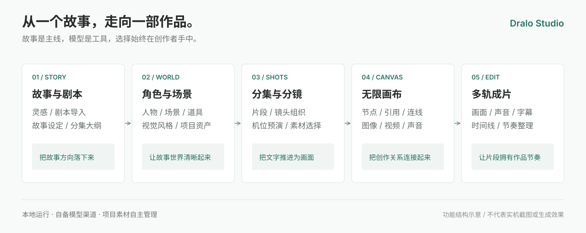
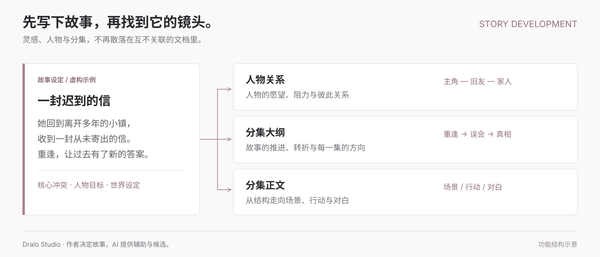
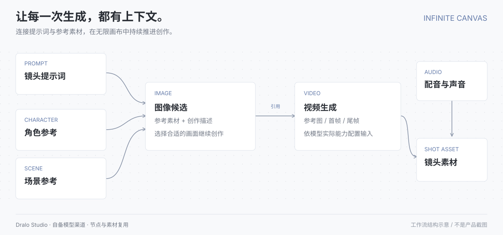
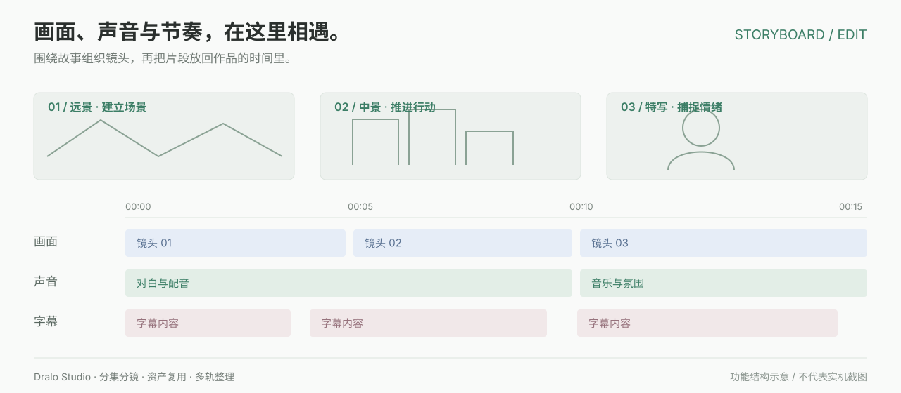

# Dralo Studio 功能介绍

Dralo Studio（短剧工坊）是一套本地运行的开源 AI 短剧创作工作台。它将剧本创作与分集分镜、无限画布、模型生成及素材整理连接起来，适合短剧、AI 漫剧和独立影像创作。

本页描述公开单机源码中的能力与依赖条件，不表示已完成所有模型、操作系统和作品类型的全量验收。结构示意图不是产品截图或生成效果保证。

## 1. 故事与剧本创作

- 从灵感、已有剧本或空项目开始，逐步整理创作资料。
- 上传或粘贴 TXT、Markdown、DOCX 文本，保留与项目关联的内容。
- 围绕故事设定、人物关系、事件和分集大纲推进创作。
- 从分集规划到正文，再衔接角色、场景和制作准备。
- 智能体提供候选与辅助内容，作者仍需要判断逻辑、节奏和内容质量。

**示例工作流**：先整理一个故事的核心冲突与主要人物，再确认分集方向，推进正文，最后准备需要在镜头中出现的角色与场景。无需为每一步重新建立一套互不关联的项目。

## 2. 角色、场景与风格

管理角色、场景及其他项目资产，为不同镜头复用创作素材和视觉方向。内置风格条目帮助组织提示词与示例，并不等于附赠生成模型或 API 额度。

人物形象、服装、场景及参考素材需要人工检查。跨镜头一致性受模型、提示词和参考输入影响，不承诺所有服务商均能自动保持一致。

## 3. 分集、片段与镜头

分集内容按动作、对白、旁白和视频模型已核验的规格规划为片段与镜头。约定集长是创作目标，不硬凑秒数；先冻结片段数量、时长和来源，再生成详细脚本并启用制作台。镜头与角色、场景、素材以及图像/视频生成操作相连接。

作者可以逐步选择和调整素材，确认适合采用的结果。生成视频的分辨率、时长、参考帧和音频能力取决于具体模型。

## 4. 无限画布与节点工作流

画布提供节点拖拽、连线和空间编排，用于组织提示词、图片、视频、声音及角色、场景等创作内容。模型生成节点与素材节点连接，表达输入与引用关系。

视频输入可区分参考图、首帧与尾帧。提示词输入支持引用相关节点，也可以从素材库添加参考文件；被连接并不代表每家模型接口都支持同一种输入组合。

**示例工作流**：角色参考 + 场景参考 + 镜头提示词 → 图像候选 → 作为视频生成的参考输入 → 将结果继续连接到后续创作内容。是否支持图生视频或首尾帧，需要查对应服务商的模型能力。

## 5. 智能体与 Skill

智能体与 Skill 配置提供任务角色、行为指导和参数组织，服务于故事、镜头及素材等创作任务。按自己的工作方式选择配置，避免把某一种供应商的行为当成所有模型的统一规则。

智能体需要相应模型渠道可用。生成内容应被视为辅助与候选，不是已经完成版权、事实或质量审查的最终作品。

## 6. 多模型渠道

公开源码包含 OpenAI 兼容接口、Google Gemini 和 Anthropic 等适配实现。用户自行添加渠道地址、凭据与模型；适配协议不代表任意服务商的任意模型都可以直接接入。

可以为文本、图像、视频与语音任务配置适合的模型和参数，费用、限流及输出格式由服务商决定。首次初始化不带作者配置的模型。

对于官方 MiniMax H3 等需要公网参考素材链接的模型，应自行配置对象存储，保证参考文件满足访问与权限要求；单机本地文件路径不能充当公网链接。

## 7. 资产与任务管理

资产中心用于整理和复用素材；任务中心用于查看生成和处理任务的状态、结果与错误。后台任务需要独立 Worker 运行。

图片、视频、音频及生成结果可能带有不同的元数据和版本关系。处理失败时应检查模型渠道、文件访问、任务日志、磁盘空间与媒体格式，而不是重复批量提交。

## 8. 媒体基础处理

画布提供裁剪、旋转、截取片段、视频抽帧、提取音轨、音画合成等基础处理入口。处理结果可能形成关联素材或新版本，原素材不应被误认为已经直接覆盖。

这些操作依赖本机 FFmpeg/FFprobe。某些语音识别及编辑渲染能力还需要单独配置额外运行时或模型权重，没有随源码自动安装。

## 9. 3D 分镜导演台

通过 3D 场景进行人物摆位、机位预演与画面参考，再为镜头创作提供构图依据。它不是通用三维建模工具，也不是最终影视渲染器。

公开版使用程序化默认人物。可以自行导入合法持有的模型；Guo 资源包、Mixamo 资源及未经确认可再分发的第三方模型不随源码公开。详见[第三方声明](../THIRD_PARTY_NOTICES.md)。

## 10. 多轨编辑与成片整理

围绕时间线组织画面、声音与字幕，连接镜头素材与作品节奏。真实输出格式、处理速度和预览能力依赖素材及本机运行环境。

**示例工作流**：选定镜头候选 → 排列画面顺序 → 整理配音与音乐 → 对齐字幕 → 检查节奏与结果。最终发布前仍需人工预览与版权检查。

## 11. 存储与隐私

单机版默认使用本地 SQLite 保存项目元数据，并把素材写入本地存储目录。模型调用可能发送提示词或参考素材到自己配置的供应商；本地运行不等于所有处理都离线。

对象存储由使用者自行开通、配置和支付。备份时应保留数据库、素材、存储配置和 `.env` 中的加密密钥。不要公开上传这些文件。

## 版本边界

| 产品 | 本仓库是否包含 |
| --- | --- |
| 单机创作工作台与本地服务源码 | 包含 |
| 官方云端账号运营与服务器部署实现 | 不包含 |
| 官方云端 Electron 轻量客户端与更新服务 | 不包含 |
| 作者模型账号、项目、用户数据 | 不包含 |
| 未取得公开再分发许可的资源包 | 不包含 |

安装步骤见[快速开始](QUICKSTART.md)，实际验证范围见[版本说明](../RELEASE_NOTES.md)。官网和微信交流入口见[项目首页](../README.md#联系与交流)。
